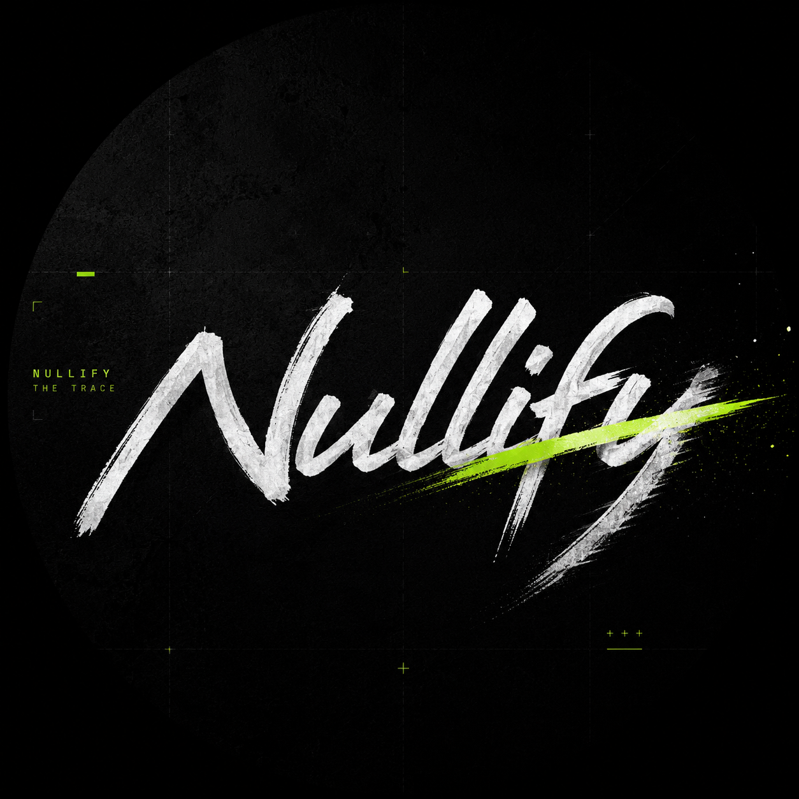

<div align="center">



# Nullify

### Cross-Chain Privacy Bridge

**"Nullify the trace."**

Deposit on one chain. Withdraw on another. Leave nothing connecting the two.


</div>

---

> **Honest status (read this first).**
> Nullify is **early, in active development**. The zero-knowledge core works **end-to-end on a
> local chain** - see [What works today](#what-works-today). It is **not deployed to any testnet
> or mainnet yet**, there are **no live contracts**, and **no token**. Do not send real funds
> anywhere; there is nowhere to send them. Testnet is the next milestone (see [Roadmap](#roadmap)).

---

## Why I built this

Cross-chain privacy is still a hard, mostly unsolved problem. Most privacy pools live on a single
chain, and bridging breaks the anonymity the moment funds move. Nullify is my attempt at the harder
version: a shielded pool whose unlinkability is meant to hold across chains, not just within one.

I built the whole stack myself, from the PLONK circuit to the contracts to the relayer, and wired
it together until a deposit on one address could become a withdrawal on another with nothing
linking the two. The proving pipeline runs end to end and the security checks hold.

It is still early, and there is real work left before testnet and mainnet. But the core works, and
I am building it in the open so anyone can read the code, verify the claims, and challenge the
design.

---

## What is Nullify

Nullify is a cross-chain privacy bridge. You deposit into a shielded pool as a cryptographic
*commitment*. To exit, you generate a zero-knowledge proof (PLONK) that you own *some* note in the
pool - without revealing which one - and a one-time *nullifier* prevents double-spends. A relayer
submits the withdrawal so the recipient needs no gas and leaves no link back to the depositor.

The aim is for that unlinkability to hold **across chains**: deposit on Base, withdraw on Arbitrum.

---

## What works today

These are things that actually run on a local Hardhat node right now - nothing here is deployed
or "live" yet.

- [x] **PLONK withdrawal circuit** (Circom) compiles and runs the trusted setup.
- [x] **End-to-end proof, verified on-chain (local):** deposit -> build Merkle path -> generate PLONK
 proof -> withdraw -> recipient receives the funds. The full loop passes (`npm run e2e`).
- [x] **Poseidon incremental Merkle tree** in Solidity, matching the in-circuit hashing so proofs
 verify against the on-chain root.
- [x] **Security / negative tests pass (3/3):** a tampered proof, an unknown Merkle root, and a
 double-spend are all correctly **rejected** (`npm run negative-test`).
- [x] **Contracts:** shielded pool, PLONK verifier wrapper, cross-chain attestor (skeleton).
- [x] **TypeScript SDK:** note creation, event-indexer that rebuilds the Merkle path, proof builder.
- [x] **Relayer node** (Fastify) that submits withdrawals.

### What does NOT work yet

- [ ] Not deployed to any testnet or mainnet. No live contract addresses.
- [ ] Trusted setup is a **development** powers-of-tau - **not** a real ceremony. Not safe for real funds.
- [ ] No external audit.
- [ ] Cross-chain attestation is a skeleton (not yet wired across real chains).
- [ ] Solana support is an early scaffold only (EVM-first).
- [ ] No browser wallet UI yet.

---

## How it works

```
 ┌────────────┐ commitment ┌──────────────────┐
 │ DEPOSIT │ ──────────────▶ │ Shielded Pool │
 │ (chain A) │ │ (Merkle tree) │
 └────────────┘ └────────┬─────────┘
 │ root
 ▼
 ┌────────────┐ zk proof + nullifier ┌─────────────────┐
 │ WITHDRAW │ ◀────────────────────── │ Verifier │
 │ (chain B) │ via relayer │ (chain B) │
 └────────────┘ └─────────────────┘
```

1. **Deposit** - your wallet makes a secret note locally and submits only `commitment =
 Poseidon(nullifier, secret)`. The pool inserts it as a Merkle leaf.
2. **Prove** - off-chain, you build a PLONK proof: "I know a note whose commitment is a leaf under
 this root, and this is its nullifier hash" - without revealing the note.
3. **Withdraw** - a relayer submits the proof. The verifier checks it, rejects spent nullifiers,
 and releases funds to a fresh recipient.

More detail: [`docs/architecture.md`](./docs/architecture.md) ·
[`docs/workflow.md`](./docs/workflow.md) · [`docs/privacy-design.md`](./docs/privacy-design.md).

---

## Run it yourself (local)

> Requires Node.js ≥ 20, `circom` ≥ 2.1, `snarkjs`.

```bash
git clone https://github.com/UseNullify/nullify.git
cd nullify
npm install

npm run ptau # download a DEV powers-of-tau (not a real ceremony)
npm run circuits:build # compile circuit + PLONK setup + generate verifier
npm run e2e # deposit -> prove -> withdraw, prints " E2E OK"
npm run negative-test # tampered proof / unknown root / double-spend all rejected
```

If `npm run e2e` prints ` E2E OK`, the proof verified on a local chain on your machine.

---

## Repository layout

```
nullify/
├── circuits/ # PLONK withdrawal circuit (Circom) + build script
├── contracts/ # shielded pool, Poseidon Merkle tree, verifier, attestor
├── sdk/ # TypeScript: notes, Merkle-path indexer, proof builder, relayer client
├── relayer/ # relayer node that submits withdrawals
├── scripts/ # local-e2e + negative tests + deploy
├── programs/ # Solana (SVM) scaffold - WIP
├── docs/ # architecture · workflow · privacy-design
└── website/ # landing page
```

---

## Roadmap

- [x] PLONK withdrawal circuit + on-chain verifier
- [x] Poseidon Merkle tree + fixed-denomination shielded pool
- [x] End-to-end proof verified locally
- [x] Negative tests (double-spend / forged proof / bad root)
- [ ] **Deploy to Base Sepolia testnet** ← next
- [ ] Relayer running against a public testnet
- [ ] Cross-chain attestation wired between two real chains
- [ ] Browser wallet UI (in-browser proving)
- [ ] Multi-party trusted-setup ceremony
- [ ] External security audit
- [ ] Mainnet

---

## Security

This is **pre-audit, experimental software**. The development trusted setup is single-party and
**must not** be used to secure real funds. The circuits and contracts have not been audited.
Mainnet would require a public multi-party ceremony and an external audit first.

Found something? Please report privately rather than opening a public issue - see
[`SECURITY.md`](./SECURITY.md).

## Responsible use

Nullify is privacy infrastructure for lawful, self-custodial use. It is not intended to facilitate
money laundering or sanctions evasion, and contributors do not support such use. Anyone running or
integrating it is responsible for complying with the laws of their own jurisdiction.

## License

[MIT](./LICENSE)
